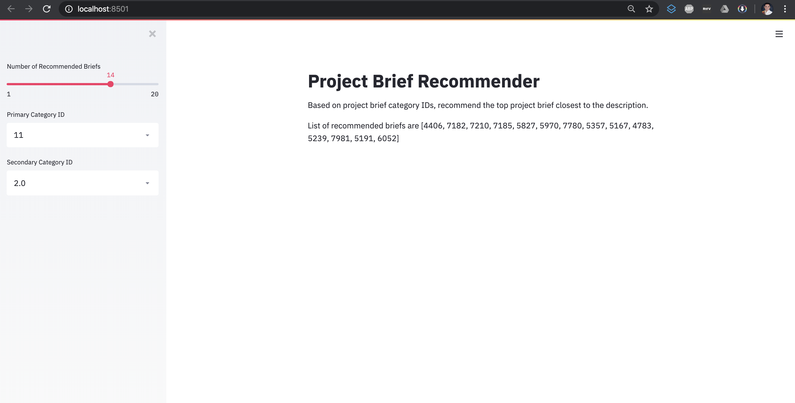

# Project Brief Web Application  
Author: Xavier M. Puspus  


### Description
I used a sample dataset on project briefs with primary and secondary categories as features. I used content-based recommendation to recommend a rank of the closest project briefs given a user input of these features.
  
### Model

I used cosine similarity to score the angular distance between two n-dimensional vectors.

### Deployment Through Web Application

I used the most recently released API of [Streamlit](https://streamlit.io) to deploy the ml model and locally serve the web app.

### Running the App

In order to run the app, you must have the basic data science packages available on your machine, (`pandas`, `numpy`, `matplotlib` and install streamlit using:

```console
foo@bar:~$ pip install streamlit
```
Afterwards, `cd` into the directory of `app.py` and run this on the terminal:

```console
foo@bar:~$ streamlit run app.py
```

### Display

The web app should look something like this:

